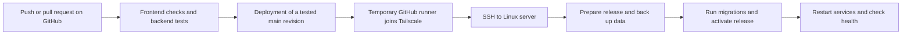

# Archived deployment review (pre-implementation)

> This document records the original server review and is retained for context.
> CI/CD is now implemented. Use [PRODUCTION_DEPLOYMENT.md](PRODUCTION_DEPLOYMENT.md)
> for the current setup, activation, deployment, and recovery instructions.

Repository review: October 6, 2026. The user supplied a successful server inventory.
Direct automated access still needs SSH key authentication.

## Confirmed server inventory

| Setting | Reported value |
| --- | --- |
| SSH target | `talinoserver2-ts` (`talinoserver2@100.72.4.80`) |
| OS / architecture | Ubuntu 24.04.4 LTS / x86_64 |
| PHP | 8.3.6, with `pdo_pgsql`, `mbstring`, DOM/XML, cURL, ZIP, and Fileinfo |
| Node.js | 22.22.2 |
| PostgreSQL client | 16.15; actual database server version still to be checked |
| Web proxy | Nginx installed and active |
| Application path | `/home/talinoserver2/Documents/dost-caraga-pr` |
| Active app units | Backend, frontend, and scheduler |
| Queue unit | No `dost-caraga-pr-queue.service` reported in installed units |
| Container runtime | Docker not found in PATH; not required for this proposed server setup |

The PHP `intl` extension is absent. It is not explicitly required by this project's
Composer dependencies and no direct Intl usage was found in application code.
Confirm production platform requirements during deployment rather than treating
this alone as a blocker. A queue worker may run under another supervisor; inspect
the processes before starting a duplicate worker.

The server listens on ports 8000 and 5173, among others. Its exact app startup
commands, Nginx routes, production environment settings, and service privileges
still need inspection; port numbers alone do not establish which mode the app uses.

## What this system does

This is a web application for DOST Caraga procurement staff and approving officers.
It connects procurement planning and budgets to purchase requests, approval routing,
supplier canvassing, Requests for Quotation (RFQ), Abstracts of Canvas (AOC), and
Purchase Orders (PO). It also records delivery/payment monitoring, audit trails,
reports, and staff notifications.

The backend routes and feature tests are the source for this overview. The README's
original Module 1 description and the September audit cover an earlier scope.
The current frontend exposes only `/login` as a public page; a supplier self-service
portal should not be assumed from older comments mentioning one.

| Component | Purpose | Production requirement |
| --- | --- | --- |
| `pr_frontend` | React/TanStack Start screens | Node.js 22.12+ and a production HTTP adapter for the server build |
| `pr_backend` | Laravel 13 API and workflow rules | PHP 8.3+, Composer dependencies, PHP-FPM or another production PHP server |
| PostgreSQL | Users, budgets, requests, approvals, quotations, audit records | Persistent database with backups |
| Laravel storage | Signed quotations and other uploaded files | Persistent storage with backups |
| Queue worker | Delivers queued emails | A supervised `php artisan queue:work` process and working SMTP |
| Scheduler | Expires unanswered RFQs hourly | A supervised scheduler or a once-per-minute `schedule:run` cron entry |
| Reverse proxy | HTTPS and routing to the frontend/API | Nginx or an equivalent existing proxy |

The RTX 5090 is not required by this application. Tailscale provides private server
access; the web application still needs its own public or private access arrangement.

## What is ready in this repository

`.github/workflows/ci.yml` runs two jobs on GitHub-hosted Linux runners:

1. **Frontend checks:** `npm ci`, ESLint, TypeScript checking, and production build.
2. **Backend tests:** locked Composer installation, Composer validation, and PHPUnit
   using disposable PostgreSQL 16 and 18 service containers. Database connection settings
   override the Linux socket defaults in `phpunit.xml`.

The `ci-only-password` is for the disposable CI database and is not a production
credential. CI needs no production secrets and has no access to the server.
The database matrix covers the server's reported client major version (16) and the
local database major version (18). Verify the production database server's version
before removing either compatibility check.

To activate CI, commit and push these files to the existing GitHub repository, then
open its **Actions** tab. Once all checks have run successfully, add **Frontend checks**,
**Backend tests (PostgreSQL 16)**, and **Backend tests (PostgreSQL 18)** as required
checks for `main` in your repository rules.
Availability of repository protection settings depends on the GitHub plan and
repository visibility.

This is continuous integration (CI). Continuous deployment/delivery (CD) is the next
step: delivering the tested revision to the server and verifying it there.
No server deployment workflow is enabled yet.

Local verification completed with PHP 8.3.33, Node.js 22.23.2, and PostgreSQL 18.6:
167 backend tests passed with 1,830 assertions on a temporary database. The
frontend production build and TypeScript checks passed; ESLint reported zero
errors and ten existing warnings. The GitHub-hosted workflow still needs its
first run after the files are pushed.

## Proposed deployment through Tailscale



Use GitHub-hosted runners for checks and a separate deployment job that joins the
tailnet with the official Tailscale GitHub Action. Start with a manual deployment
trigger for a passing revision on `main`; automatic deployment on successful pushes
can follow once the first deployment and recovery procedure have been verified.
The release must use the exact commit that passed CI rather than pulling whichever
commit happens to be latest when deployment starts.

The deployment runner needs a dedicated Tailscale identity. Your personal ability
to SSH to the server does not automatically grant the runner that access. Configure
its tag to reach this server and its deployment user. For native Tailscale SSH,
the tailnet policy must permit both the network connection and SSH authentication
without requiring interactive approval for every deployment. For ordinary OpenSSH
over Tailscale, configure a dedicated SSH key and verify the host key.

Tailscale supports workload identity federation and OAuth clients for its GitHub
Action. Choose the authentication method after checking the tailnet configuration.
Store any required secrets in GitHub settings, not in this repository or chat.

## Inspect the existing server first

Your provided SSH configuration is:

```sshconfig
Host talinoserver2-ts
  HostName 100.72.4.80
  User talinoserver2
```

The connection check reached that SSH endpoint and matched its existing known host
key. Noninteractive login failed with `Permission denied (publickey,password)`:
the local SSH agent had no identities, and the default SSH identity files were
not present. The supplied inventory subsequently confirmed the Linux release and
active service names listed above.

To enable further inspection without relaying every command, run this once from
your Mac terminal in the repository:

```bash
bash scripts/setup-server-access.sh
```

Choose a local key passphrase at `ssh-keygen`'s prompts, then enter it again if
`ssh-add` asks. Enter the server password at the SSH prompt when installing the
public key. The key stays at `~/.ssh/dost-caraga-pr-server_ed25519`; only its public
half is added to the server's `~/.ssh/authorized_keys`. Existing authorized keys
are preserved, and repeating the script does not append the same key again.
The script validates login and does not change the app or restart services.
This key is for local access; use a separate deployment identity for GitHub Actions.

Once this reports success, Codex can connect using:

```bash
ssh -i ~/.ssh/dost-caraga-pr-server_ed25519 -o IdentitiesOnly=yes talinoserver2-ts
```

Run this from the repository in your own terminal, where SSH can prompt for your
password if that is how you normally sign in:

```bash
ssh talinoserver2-ts 'bash -s' < scripts/inspect-server.sh
```

For a different project path, pass that path to the remote script:

```bash
ssh talinoserver2-ts 'bash -s -- /srv/dost-caraga-pr/current' < scripts/inspect-server.sh
```

The script reads the Linux version, available runtimes, related service names,
listening sockets, and existence of selected project files. It does not install
packages, restart services, read `.env` values, inspect logs, or modify the database.
The `psql` version is the client version; confirm the database server version
separately if PostgreSQL is hosted elsewhere.

Share the inventory output to finish the deployment configuration. Enter passwords
only into your SSH terminal prompt. Automated deployment will need a dedicated
noninteractive identity configured on the server or in the Tailscale SSH policy.

Existing queue and scheduler service files reference:

- User: `talinoserver2`
- Application directory: `/home/talinoserver2/Documents/dost-caraga-pr`
- A backend service named `dost-caraga-pr-backend.service`, whose definition is
  not present in this repository.

`pr.dostcaraga.ph` appears in configuration, but its current routing and availability
have not been verified. Confirm the actual frontend, backend, proxy, and TLS setup
before replacing anything on a running server.

## Production gaps identified in the scan

1. **Frontend startup:** `vite build` produces `dist/client` and
   `dist/server/server.js`. The server bundle exports a `fetch` handler; it does not
   open an HTTP port by itself. There is no production `start` script or HTTP adapter
   in this repository. Select an adapter, such as Nitro, and verify the built app
   over HTTP before enabling CD. Merely running `node dist/server/server.js` will
   not start this build as a web server.
2. **API routing:** the Vite `/api` proxy is a development setting. Configure the
   production reverse proxy to send `/api/*` to Laravel and frontend requests to
   the frontend process. Keep the browser API URL as `/api/v1` for one-domain hosting.
   A separate API domain needs matching frontend build settings and backend CORS.
3. **Persistent data:** preserve the server `.env`, `APP_KEY`, database, and
   `pr_backend/storage` across releases. The local disk contains private quotations;
   it must not become a public static directory.
4. **Worker updates:** restart queue and scheduler processes when switching releases
   so they load the new code. Reload PHP-FPM as appropriate for its opcode cache.
5. **Production initialization:** `npm run setup` runs demo seeders. The seeders
   create sample records and reset several known demo account passwords through
   `updateOrCreate`. Do not use that command for production installation or updates.
   Prepare a separate production bootstrap for roles, offices, and the first admin.
6. **Migration recovery:** some existing migrations delete columns or transform
   records. Back up PostgreSQL and uploaded files before deployment. Reverting code
   alone does not undo a database migration or recover removed data.

For a Linux deployment, use a production PHP server rather than the `artisan serve`
process in `npm run dev`. Laravel's web root is `pr_backend/public`; only its
`storage` and `bootstrap/cache` directories need runtime write access.

## Server environment

Create or preserve the actual `.env` on the server. Important settings are:

```dotenv
APP_ENV=production
APP_DEBUG=false
APP_URL=https://YOUR_APP_DOMAIN
FRONTEND_URL=https://YOUR_APP_DOMAIN
APP_TIMEZONE=Asia/Manila
LOG_LEVEL=warning
DB_CONNECTION=pgsql
DB_HOST=127.0.0.1
DB_PORT=5432
DB_DATABASE=YOUR_PRODUCTION_DATABASE
DB_USERNAME=YOUR_DATABASE_USER
DB_PASSWORD=YOUR_DATABASE_PASSWORD
QUEUE_CONNECTION=database
FILESYSTEM_DISK=local
MAIL_MAILER=smtp
```

Copy the remaining settings from `.env.example`, replace SMTP placeholders with
real server settings, and keep or generate `APP_KEY` once for that environment.
The correct `DB_HOST` may be a socket or another host depending on the server.
`VITE_` frontend values are public and embedded at build time; put no credentials
in them. Choose real values before building a release.

## Release procedure to implement after inspection

1. Prepare a separate directory for the tested commit. Install locked dependencies
   and build the frontend without touching the active release.
2. Link the server environment and persistent storage into that release. Check
   write permissions for the PHP process, queue worker, and deployment user.
3. Back up the production database and uploads. Coordinate web traffic, workers,
   and the scheduler during migrations when a change requires downtime.
4. Run `php artisan migrate --force` with the production environment. Do not run
   `migrate:fresh`, `db:wipe`, or the demo seeders against production.
5. Cache Laravel configuration/routes/views with `php artisan optimize`. Switch
   the active release, restart the frontend, queue worker, and scheduler, and
   reload PHP-FPM as required.
6. Check the frontend login page, the Laravel `/up` endpoint, a database-backed
   API request, and queue/email delivery. `/up` alone does not prove the database
   and SMTP connection are working.
7. Keep the previous release. Use it for code rollback only when it remains
   compatible with the new schema; otherwise recover from the backup under a
   planned maintenance window.

The concrete deployment script, service definitions, reverse proxy configuration,
and GitHub deployment job depend on the Linux distribution, current services,
application location, and Tailscale access policy. These are still to be confirmed.

## Reference documentation

- [GitHub: PostgreSQL service containers](https://docs.github.com/en/actions/tutorials/use-containerized-services/create-postgresql-service-containers)
- [Tailscale: GitHub Action authentication and access](https://tailscale.com/docs/integrations/github/github-action)
- [Laravel 13: production deployment](https://laravel.com/framework/docs/13.x/deployment)
- [TanStack Start: hosting and production adapters](https://tanstack.com/start/latest/docs/framework/react/guide/hosting)
